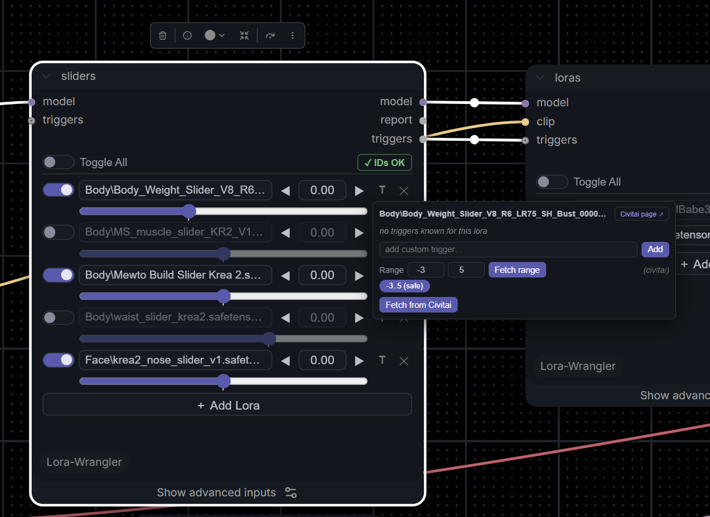
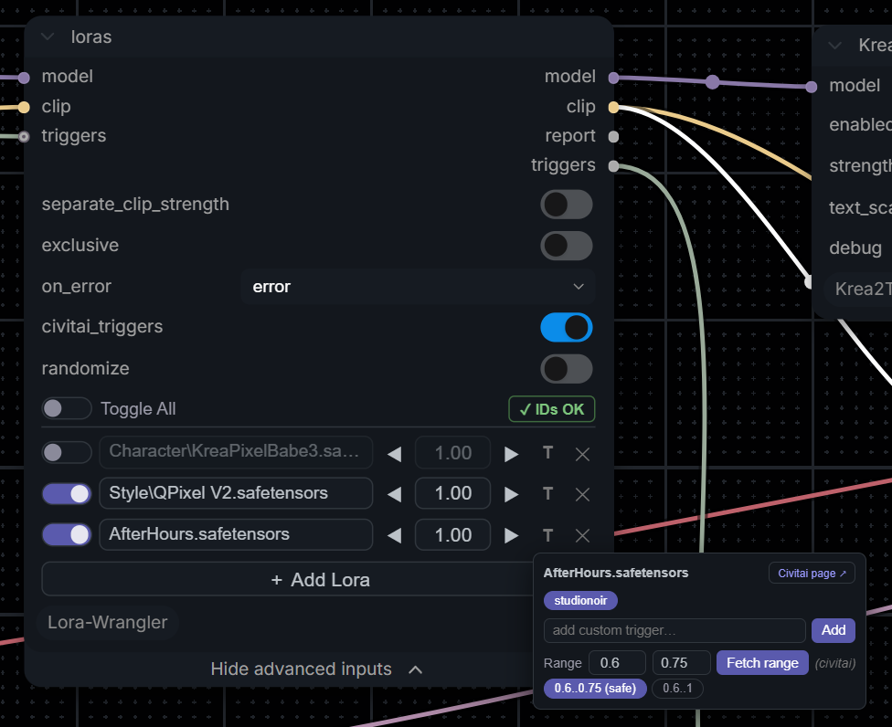

# LoRA Wrangler

**A LoRA stack, library tool and API service for ComfyUI. Built for the Nodes 2.0 frontend and for libraries with thousands of LoRAs.**



Two stack nodes hold as many LoRAs as you want in compact rows: a toggle, a searchable name, a strength field and a trigger manager. Behind them sits everything that usually breaks once a workflow leaves your machine: LoRAs filed under different names, LoRAs that aren't installed, and servers that have never seen your library.

It was developed against a 2,000+ LoRA library and a game asset pipeline that drives ComfyUI over the API. It's made for power users who know what they want: people with big libraries, people who automate, and people who'd rather not fill their canvas with helper nodes.

## Why it's different

- **Two nodes, nothing else.** No sidebar app, no extra tabs, no browser extension, no chain of helper nodes. Everything lives in the stack node and ComfyUI's own settings.
- **Built for Nodes 2.0.** The rows are real HTML mounted as a DOM widget, not drawn on the litegraph canvas, so they work in the new Vue renderer and in the classic canvas. The UI only edits one hidden text input. If it ever fails to load, the node shows that text box instead and keeps working.
- **Made for big libraries.** The picker loads the LoRA list once per page and filters as you type, with multi-word search, keyboard navigation, multi-select, and "select all" on a filtered folder. No giant combo dropdown to scroll.
- **Inactive rows are free.** Toggled-off and zero-strength rows are skipped before any disk read or model patch, so a whole bank can live in one node.
- **Sliders are first-class.** A model-only stack, negative strengths, fine ◀ ▶ steps, and recommended ranges pulled from Civitai descriptions that keep the arrows inside a slider's useful range.
- **Trigger words, handled.** Each node outputs the trigger words of its active LoRAs and chains them into the next node. Pick which of a LoRA's trained words you actually want once, and that choice applies in every workflow.
- **Workflows that travel.** Rows carry a hash-based identity stamp. On another machine the node finds the same file under a different name or folder, or downloads it from Civitai, verifies it, and carries on, all inside the run.
- **Manifests that drive server downloads.** Export a manifest of your library, drop it on a dev or render server, and LoRAs that aren't installed there show up in the picker. Pick one, or name it in an API call, and the server downloads it during the run. We haven't found another ComfyUI tool that does this.
- **API and agent first.** The whole stack is one string input. A stdlib-only Python helper edits it without losing anything, and JSON endpoints cover listing, triggers, ranges, identity, pre-flight checks, downloads and manifests.

## Install

```bash
cd ComfyUI/custom_nodes
git clone https://github.com/Kinglord/ComfyUI-Lora-Wrangler
```

Restart ComfyUI and hard-refresh the browser (Ctrl+F5). There are no extra Python dependencies. The nodes appear under **loaders**.

## The nodes

| Node | Patches | Use it for |
| --- | --- | --- |
| **LoRA Wrangler: Slider Stack (model only)** | MODEL | Slider LoRAs, and anything that should never touch CLIP. |
| **LoRA Wrangler: LoRA Stack (model+clip)** | MODEL and CLIP | Regular LoRAs. One strength drives both unless you split them. |

Options live in each node's collapsed **Advanced** section:

| Option | Node | What it does |
| --- | --- | --- |
| `separate_clip_strength` | model+clip | Shows separate **M** and **C** fields per row. Display only: `name : 0.8 : 0.5` in the text works either way. |
| `exclusive` | model+clip | Only one row may be active. The UI switches the others off, and the backend enforces it for API edits too. Made for one-of-N banks such as body types. |
| `randomize` | both | Each run applies exactly one enabled row, picked at random, and re-rolls on every queue. Your toggles define the pool. Overrides `exclusive`. |
| `on_error` | both | `error` fails the run on unknown names. `skip` reports them and continues. |
| `civitai_triggers` | both | Looks LoRAs up on Civitai by file hash, once per file, for trigger words and identity. Turn off for fully offline use. |

Outputs are `model` (plus `clip` on the model+clip node), `report`, which lists what applied and why, and `triggers`, a comma-separated string. The optional `triggers` input takes the previous stack's output, so the last node in a chain emits the triggers of every active LoRA across all of them, deduplicated.

## Working with the rows



- **＋ Add Lora** opens the picker. A plain click adds that LoRA immediately. Ctrl/Cmd-click or the checkbox starts a multi-selection, and **Add selected** commits it. Filter down to a folder such as `Face\` and hit **Select all** to add the whole folder. Enter adds, Esc closes.
- Batch-added rows on the slider node arrive at strength 0, so you can roster a bank at zero cost. Single adds and regular LoRAs arrive at 1.0. In exclusive mode, batch adds arrive switched off.
- Click a row's name to swap the LoRA. ◀ ▶ step by 0.05, or 0.25 with Shift. Type in the field for exact values, or click it and use the mouse wheel to step by 0.05. The wheel only adjusts a field you've clicked into, so scrolling over the node still zooms the canvas. ✕ removes the row.
- **Toggle All** in the header turns everything on if anything is off, and everything off otherwise.
- **T** opens the trigger manager: each trained word as a toggleable pill, your own custom triggers, the recommended strength range, a **Fetch from Civitai** button, and a link to the LoRA's Civitai page. The button glows when the row has a saved selection.
- The **ID** button in the header shows whether every row has an identity stamp, which lets other machines find or download that row's LoRA. Green **✓ IDs OK** means there's nothing to do. Amber **Stamp N IDs** means some rows still need one: hover to see which, and click to add them. Rows are also stamped automatically when added and when the workflow runs, so it rarely stays amber.
- The header shows download progress while a missing LoRA is being fetched.

### Trigger words

Each LoRA's triggers are resolved from the first source that has any:

1. A `# triggers: a, b` annotation on the row, which is a per-workflow override.
2. Your saved selection from the T popup, which applies everywhere that LoRA is used.
3. A sidecar next to the file: `<lora>.txt`, `<lora>.json` or `<lora>.civitai.info`.
4. `modelspec.trigger_phrase` in the safetensors header.
5. Civitai's trained words, looked up by hash when `civitai_triggers` is on.
6. A manifest entry with the same hash.
7. A guess from kohya's `ss_tag_frequency`, clearly labelled as inferred in the popup.

A file's hash is computed once and cached, and a successful Civitai lookup is written back as a `.civitai.info` sidecar. Each file touches the network at most once. Unknown files are re-checked weekly, and network failures never fail a run.

### Recommended strength ranges

The T popup has a **Range** row. Set it by hand, or hit **Fetch range** to search the LoRA's Civitai description for phrases like `-2 to 3`, `between -5 and 10` or `±4`. When a description lists several ranges, such as a safe and a max range, each becomes a clickable chip with the safe one selected. A known range clamps the ◀ ▶ buttons and shows in the tooltip. Typed values are never clamped, and hand-set ranges are never overwritten by a fetch.

## Advanced features

### Exclusive banks: exactly one at a time

Turn on `exclusive` on the model+clip stack to make it a one-of-N bank: body types, outfits, art styles. Switching one row on switches the others off, so changing looks is a single click.

The backend enforces the rule too, so a workflow edited by code can't quietly apply two. If more than one row is active, `on_error: error` fails the run and names them, and `on_error: skip` applies the first and flags the rest in the report. From code, `set_solo(wf, nid, "outfit_b")` switches one row on and the rest off.

> [!TIP]
> Keep a whole bank in one exclusive stack rather than one stack per variant. Inactive rows cost nothing at run time.

### Randomize: a different LoRA every run

Turn on `randomize`, on either node, and each queued run applies exactly one enabled row, picked at random, at that row's own strength. Your toggles define the pool, so switch off anything you don't want in the draw. The node re-runs on every queue even when nothing else changed. The report's first line names the pick, and the `triggers` output carries only the pick's triggers. Randomize overrides `exclusive`.

The pick isn't seeded. To reproduce a result, read the pick from the report, switch randomize off, and `set_solo` that row.

> [!TIP]
> Randomize with a batch count is a quick tour of a whole bank. Queue ten runs, and each run's report names the LoRA it used.

### Chained trigger words

Wire each stack's `triggers` output into the next stack's `triggers` input, alongside MODEL and CLIP. Each node adds its active LoRAs' triggers without duplicates, so the last node emits every trigger across the chain. Join it with your prompt using ComfyUI's **Concatenate Text** node.

### Separate model and CLIP strengths

`separate_clip_strength` on the model+clip node shows separate **M** and **C** fields per row. It only changes the display. The text format `name : 0.8 : 0.5` works either way, so code can always split them.

### Slider banks

The slider stack is model-only, so it never touches CLIP. Batch-added rows arrive at strength 0, so you can load a folder of sliders as a roster and dial in only the ones you use. Negative strengths work. A known recommended range keeps the ◀ ▶ arrows inside it, and typed values are never clamped.

Each row on the slider stack also gets a **slider bar** under its name. Drag it, or click it and use the mouse wheel. Its ends are the LoRA's recommended range, so setting or fetching a range in the T popup reshapes the bar. With no range known it spans -3 to 3, and it always stretches to include a value you typed. A tick marks 0, the neutral point for most sliders. Turn the bars off under **Settings > LoRA Wrangler > Slider Stack**.

### Stop or carry on

`on_error: error`, the default, fails the run on anything wrong: an unknown name, an unreadable line, or several rows active in exclusive mode. `skip` applies everything it can and lists the rest in the report. Use `error` in pipelines, where a missing LoRA should stop the job, and `skip` while exploring.

## Seeing what happened

Every run leaves a trail. This is where to look, and what each place is good for.

### The report output

Each stack has a `report` output. Wire it into ComfyUI's built-in **Preview as Text** node to see it on the canvas after every run:

```
LoRA Wrangler: 3 active, 2 inactive, 1 problem(s)
 [x] Body/curvy.safetensors : 0.8  [triggers: curvy body]
 [x] Style/foo.safetensors : 1  (relocated by hash-cache from 'old/foo')  [triggers: foo]
 [x] auto_download/bar.safetensors : 0.6  (downloaded from 'bar')
 [ ] detail_slider : 0
 [ ] grain_slider : 0.15 (off)
 [!] missing_one : 1  <- 'missing_one' not found in loras folder (...)
```

| Marker | Meaning |
| --- | --- |
| `[x]` | Applied. Shows the file actually used, its strength, how it was found when not by name, and the triggers it contributed. |
| `[ ]` | Skipped: switched off, at strength 0, or not the one active row in an exclusive bank. |
| `[!]` | A problem, with the reason. |

The first line counts active, inactive and problem rows, and names the pick when randomize is on. The report answers the usual questions: did my LoRA apply, at what strength, which file did this machine use, and which trigger words went into the prompt.

### The triggers output

Wire `triggers` into **Preview as Text** as well to see exactly which trigger words the stack contributes.

### The ComfyUI console

Each stack logs its report's first line on every run. The console also shows Civitai lookups, downloads and their hash checks, manifests as they load, and manifest export progress.

### In the browser

- Before each queue, a notice lists LoRAs that are missing, will be downloaded, or were found under another name.
- The stack header shows download progress, and the ID button shows whether every row is stamped.
- After a run, rows found under another name are renamed to match this machine, and missing stamps are filled in.

### From code

`POST /lora_wrangler/check` tells you what a server would do with each row without running anything. `GET /lora_wrangler/civitai_key` shows the server's download mode and whether a key is set. [Reading results over the API](#reading-results-over-the-api) covers reports, errors and download progress.

## Sharing workflows between machines

Every row can carry an identity stamp in its comment:

```
body/weight_slider : 0.8   # sha: 0123456789ab; civitai: 123456@654321; size: 144703488
```

`sha` is the first 12 hex digits of the file's SHA256, which is also Civitai's short hash. `civitai` is `modelId@versionId`, and a bare version id or an AIR string also works. `size` is in bytes. A `url` field marks a file hosted on Hugging Face.

When a workflow runs, each active row goes through this ladder:

1. **Name match.** If the row is stamped and the same-named file has a different size, it is treated as someone else's LoRA and the ladder continues.
2. **Identity match.** The same file under any name or folder, found through the hash cache, `.civitai.info` sidecars from this node or from Civitai Helper, and hashing only files whose size matches the stamp. The report says `relocated by hash`, and the row in the UI is renamed to match.
3. **Download**, if this server's auto-download mode allows it. The file goes into the row's own subfolder when that folder already exists here, and into `auto_download/` otherwise. It is streamed to a `.part` file, checked against Civitai's SHA256 and the stamp, and only then moved into place. The node's progress bar tracks it, Cancel aborts it, and the run continues as soon as it lands.
4. **The `on_error` handling**, with a message that says what went wrong: no stamp, auto-download off, not in a manifest, no API key, early access, removed from Civitai, not a LoRA, or a hash mismatch.

Before every queue, the UI checks every active row in every stack locally and pops a notice listing what is missing, what will be downloaded, and what was found under another name.

### Settings

Under **Settings > LoRA Wrangler**:

| Setting | Default | What it does |
| --- | --- | --- |
| Auto-download missing LoRAs | Off | Controls step 3 of the ladder. **Manifest LoRAs only** downloads just the LoRAs listed in this server's manifests. **Any stamped LoRA** downloads whatever a workflow names. |
| Civitai API key | empty | Needed for most Civitai downloads. Create one under Account Settings > API Keys on civitai.com. Stored on the server, shown masked once saved. Clear the field to remove it. |
| Download folder | `auto_download` | Where downloads go when the row's own folder doesn't exist here. Always inside your LoRA folder. |
| Match workflow folders | on | Downloads a `Style/foo` row into your existing `Style` folder, matched case-insensitively. |

The auto-download mode and the API key live on the server, not in ComfyUI's settings. They can only be changed from a browser or script running on the server machine itself. Anywhere else, the panel shows the current values, refuses changes, and explains why. On a remote server, set them with environment variables.

Environment variables override the settings:

| Variable | Effect |
| --- | --- |
| `CIVITAI_API_KEY` | The API key. `CIVITAI_TOKEN` and `CIVITAI_API_TOKEN` also work. |
| `LORA_WRANGLER_AUTO_DOWNLOAD` | `manifest` for manifest LoRAs only, `any` (or `1`) for any stamped LoRA, `off` (or `0`) for none. |
| `LORA_WRANGLER_DOWNLOAD_FOLDER` | The download folder name. |
| `LORA_WRANGLER_MATCH_FOLDERS=0` | Turns folder matching off. |
| `LORA_WRANGLER_MANIFESTS` | Extra manifest files or folders, separated by `;`. |
| `LORA_WRANGLER_ALLOW_MANIFEST_PUSH=1` | Allows installing manifests over the API. Off by default. |

## Manifests

A manifest lists LoRAs a server doesn't have. The picker shows them marked ☁, and a row named after one resolves and downloads through the ladder above, stamped or not. That lets you build workflows on a machine that doesn't hold the library.

A manifest is also the allowlist for the **Manifest LoRAs only** download mode. In that mode the server fetches a manifest entry's own file, whatever identity the workflow claims, so a workflow can only choose from what you listed. Use this mode on any server other people can reach.

```json
{"loras": [
  {"name": "Style/foo.safetensors", "sha": "0123456789ab",
   "civitai": "123456@654321", "size": 144703488,
   "triggers": ["foo"], "range": [-2, 3]}
]}
```

A plain list of records or a `{name: record}` object also works. Manifest triggers and ranges feed the T popup for LoRAs that aren't installed yet.

**Build one on the machine that has the files.** Don't write it by hand:

```powershell
Invoke-WebRequest -Uri "http://127.0.0.1:8188/lora_wrangler/manifest/export?info=1" -OutFile lora_manifest.json
```

On a large library, always filter the export. `info=1` keeps LoRAs with a `.civitai.info` sidecar, which are the ones you've actually used. `known=1` keeps LoRAs the node has already hashed. `folder=` narrows either one. An unfiltered export hashes and looks up every file once, so it refuses to run on more than 500 LoRAs unless you add `all=1`. Progress is logged to the ComfyUI console, `GET /lora_wrangler/manifest/export/status` reports it, and `POST /lora_wrangler/manifest/export/cancel` stops it. Closing the browser tab does not.

**Install it by copying the file** into a `manifests` folder inside this node's folder on the target server. It is picked up without a restart. Refresh the browser to see it in the picker. Several files merge, and later file names win on a duplicate LoRA name. To update, export again and overwrite the file.

## Automation: API and agents

The stack is one string, `prompt[node_id]["inputs"]["loras"]`, one row per line:

```
detail_slider : 0.40
body_b : 0.8 : 0.5                      # model strength : clip strength
!kreasliders/contrast_slider : -0.25    # leading '!' = switched off
face/eyes : 1  # triggers: sharp eyes; sha: 0123456789ab; civitai: 123456@654321; size: 144703488
```

Names resolve case-insensitively, with the extension and subfolder optional. `:`, `=` and `@` all work as separators, and `<lora:name:0.5>` tags are accepted. Comments are `;`-separated `key: value` fields, and anything unknown is kept.

### The Python helper

`api_helper.py` uses only the standard library, so copy it into any project or agent sandbox.

```python
import json, urllib.request
from api_helper import find_stack_node, set_strength, set_solo, set_enabled, zero_all

wf = json.load(open("workflow_api.json"))      # API-format workflow
nid = find_stack_node(wf)                      # or find_stack_node(wf, title="Body Bank")

zero_all(wf, nid)                              # keep the roster, all strengths to 0
set_strength(wf, nid, "detail_slider", 0.4)    # model and clip
set_strength(wf, nid, "body_b", 0.8, clip_strength=0.5)
set_solo(wf, nid, "body_c", strength=1.1)      # this one on, the rest off
set_enabled(wf, nid, "grain_slider", False)    # switch off, keep the value

urllib.request.urlopen(urllib.request.Request(
    "http://127.0.0.1:8188/prompt",
    data=json.dumps({"prompt": wf}).encode(),
    headers={"Content-Type": "application/json"}))
```

The `set_` functions and `zero_all` edit lines in place, keeping row order, comments, section headers, stamps and trigger annotations. `get_stack` returns each row's comment and stamp, and `render` rebuilds the text from that dict with row comments intact, but drops standalone comment lines.

| Group | Functions |
| --- | --- |
| Edit a workflow, no server needed | `find_stack_node`, `get_stack`, `render`, `set_strength`, `set_many`, `set_enabled`, `set_solo`, `zero_all`, `get_stamp`, `set_stamp` |
| Ask a server | `list_loras`, `get_range`, `set_range`, `civitai_status`, `set_civitai_key`, `check_stack`, `download_missing`, `stamp_stack` |
| Manifests | `get_manifest`, `export_manifest`, `push_manifest` |

### One workflow, many servers

Stamp the workflow once on the machine that has the files, then send the identical JSON everywhere. Each server resolves the stamps on its own: by name, by hash under another name, or by download. Nothing in the request changes per server. Per-server differences belong in environment variables.

```python
from api_helper import stamp_stack, check_stack, download_missing

stamp_stack(wf, nid, base_url="http://authoring-box:8188")   # once, at the source

for host in servers:                                          # optional warm-up
    print(check_stack(wf, nid, base_url=host)["rows"])        # found / relocated / downloadable / missing
    download_missing(wf, nid, base_url=host)                  # fetch now, so runs never wait
```

### Endpoints

| Route | Purpose |
| --- | --- |
| `GET /lora_wrangler/loras` | List LoRAs. Filters: `folder`, `search`. `triggers=1` adds effective triggers and ranges, `manifest=1` adds manifest-only entries. |
| `GET` / `POST /lora_wrangler/triggers` | Known and saved triggers for a LoRA (`fetch=1` asks Civitai), or save a selection. |
| `GET` / `POST /lora_wrangler/range` | Recommended range (`fetch=1` searches Civitai), or save one. |
| `POST /lora_wrangler/identity` | Identity stamp fields for LoRAs by name. |
| `POST /lora_wrangler/check` | Pre-flight: what the server would do with each row. Local only, cheap. |
| `POST /lora_wrangler/download` | Download one row now, under the same auto-download mode as a run. |
| `GET` / `POST /lora_wrangler/civitai_key` | Whether a key is set and the auto-download mode, or change them with `{"key"}` or `{"auto_download": "off" \| "manifest" \| "any"}`. Changes are accepted only from the server machine. The key is never returned. |
| `GET /lora_wrangler/manifest` | Every manifest entry, and whether this server has it. |
| `POST /lora_wrangler/manifest` | Install a manifest. Needs `LORA_WRANGLER_ALLOW_MANIFEST_PUSH=1`. |
| `GET /lora_wrangler/manifest/export` | Build a manifest from this server. Filters: `folder`, `search`, `info=1`, `known=1`, `all=1`. |
| `GET .../export/status`, `POST .../export/cancel` | Watch or stop a running export. |

### Reading results over the API

Stack nodes aren't output nodes, so their `report` doesn't reach the API's history on its own. Add a **Preview as Text** node, class `PreviewAny`, and wire the report into it. The report is output 1 on the slider stack and output 2 on the model+clip stack.

```python
report_out = 2 if wf[nid]["class_type"] == "CallsignLoraStack" else 1
wf["lw_report"] = {"class_type": "PreviewAny", "inputs": {"source": [nid, report_out]}}

# ...queue the prompt, wait for it to finish, then:
history = json.load(urllib.request.urlopen(f"http://127.0.0.1:8188/history/{prompt_id}"))
report = history[prompt_id]["outputs"]["lw_report"]["text"][0]
```

Wire `triggers`, the last output on both nodes, into a second preview node the same way.

- **Failures.** With `on_error: error`, a failed run comes back as an execution error whose message starts with `LoRA Wrangler:` and lists every problem.
- **Download progress.** ComfyUI's websocket carries `lora_wrangler.download` events: `{"node_id", "name", "state", "done", "total"}`, where `state` is `start`, `progress`, `done` or `error`. The final event adds `resolved` or `error`.
- **Row updates.** `lora_wrangler.rows` events carry `{"node_id", "updates": [{"name", "resolved", "how", "fields", "replace"}]}`: renames after relocation or download, and new stamp fields. The browser applies them. An API client can apply them to its own copy of the workflow, or ignore them.

### Notes for agents

- Edit only the stack node's `loras` input, plus its options: `exclusive` (model+clip only), `randomize`, `on_error`, `civitai_triggers`. Everything else in the workflow is ordinary ComfyUI.
- Use the helper's edit functions, or keep each line's `# ...` comment intact. Comments carry the identity stamp and trigger overrides.
- For a deterministic one-of-N choice, use `set_solo` with `randomize` off. For variety, set `randomize` to true and read the pick from the report's first line. Picks aren't seeded, so reproduce one with `set_solo`.
- Prefer `on_error: error` in pipelines, so a missing LoRA fails loudly with a readable message instead of producing a wrong image.
- Wire the report into a `PreviewAny` node whenever you need to verify what a run applied, then read it from the history.
- Stamp once where the files live, then send the same workflow to every server. Never rewrite a workflow per server.
- Call `check_stack` before queueing when you need to know whether a run will download or fail.
- On large libraries, export manifests with `info=1` or `known=1`.

## Security

ComfyUI has no authentication. Anyone who can reach its port can queue workflows, and a queued workflow is enough to trigger a download. So the auto-download mode decides what a stranger on your network could make your server fetch.

> [!WARNING]
> **"Any stamped LoRA" is high risk on a server other people can reach.** Anyone who can reach the port can make it download any LoRA on Civitai, using your API key, or any file on Hugging Face, into your LoRA folder. Use it only on your own machine or a private network. On a shared or exposed server, use **Manifest LoRAs only** or leave auto-download off.

What protects you:

- **Auto-download is off by default**, and only you can turn it on. The mode and the API key are stored on the server and change only from the server machine itself or through environment variables. ComfyUI's own settings store, which anyone can write to, has no say.
- **Manifest mode is an allowlist.** The server downloads only files listed in its own manifests, and it fetches the manifest entry's file rather than whatever the workflow claims. Installing manifests over the API is disabled unless the server opts in with `LORA_WRANGLER_ALLOW_MANIFEST_PUSH=1`.
- **Only LoRAs, only safetensors, only two hosts.** Downloads come from civitai.com or huggingface.co. Civitai entries must be a LoRA, LoCon or DoRA with a `.safetensors` file, and each file is checked against Civitai's SHA256 before it is moved into place. A Hugging Face `url` is checked when the row or manifest also carries a `sha`, so always include one.
- **Downloads stay inside your LoRA folder.** Nothing is overwritten, the download folder setting can't point elsewhere, and a download that won't fit on disk is refused before it starts.
- **The key stays secret.** It never enters a workflow or image metadata, and no endpoint returns it.

ComfyUI itself exposes far more than this node does to anyone who can reach it. Keep any server you care about on a private network or behind an authenticating proxy.

## Files the node keeps

| File | Contents |
| --- | --- |
| `civitai_key.json` | Your Civitai API key and the auto-download mode. |
| `civitai_trigger_cache.json` | File hashes and Civitai lookups. Delete it to force fresh lookups. |
| `trigger_prefs.json` | Saved trigger selections and ranges. |
| `manifests/*.json` | Your manifests. |
| `<lora>.civitai.info` | Written next to a LoRA after a Civitai lookup or download. |

All of these are per-install and git-ignored. Share workflows and manifests, not the node folder.

## Limitations

- **One key and one mode per server.** Under `--multi-user`, every user's runs share the server's key and auto-download mode.
- **Remote browsers can't change the key or the mode.** That's deliberate. Use the environment variables on remote servers. If ComfyUI sits behind a reverse proxy on the same machine, every request looks local, so the proxy must do the authentication.
- **Some models can't be downloaded** with any key: early access you haven't unlocked, creator-disabled downloads, and removed models. The report says which. LoRAs that aren't on Civitai need a `url` field or a manual copy.
- **The picker list is loaded once per page.** Refresh the browser after adding LoRAs or manifests.
- **API edits don't update an open browser.** If you change the text over the API while the workflow is open, the rows update on reload. Execution always uses what was posted.
- **The first stamp or export of a big library** hashes each file once. After that it's cached.

## Built with AI assistance

LoRA Wrangler was built with AI assistance. We also use AI to help review issues and pull requests, so the project stays alive and as up to date as possible.

## License and credit

Apache License 2.0, © 2026 Callsign Games. See [LICENSE](LICENSE) and [NOTICE](NOTICE).

You're free to use, change and redistribute this code, including in commercial projects and inside other projects. The license asks three things of anyone who redistributes it or builds on it:

- Include a copy of the license.
- Carry the credit from our [NOTICE](NOTICE) file into your own NOTICE file, your documentation, or wherever your project credits third parties.
- Mark the files you changed.

These conditions apply equally to code copied by people and to code copied by AI agents or other automated tools.

If LoRA Wrangler's code or ideas helped your project, please credit it and link back here.
